  

  

---

##  Hello!

I'm **Anirban Das**, a passionate learner focused on **Cybersecurity, Development, and Ethical Hacking**.  
I enjoy exploring new technologies, improving my skills, and building my career step by step.

---

## 📌 About Me
<h3>
  🎓 Education
</h3>

<ul>
  <li>Madhyamik - Janai Training High School (2021)</li>
  <li>Higher Secondary - Janai Training High School (2023)</li>
  <li>BCA - The Calcutta Anglo Gujarati College</li>
</ul>

### 💼 Work Experience
I currently do not have any formal work experience, but I am actively looking for opportunities and continuously improving my skills.

### 🚀 Personal Interests
- Learning New Programming Languages  
- Cybersecurity & Ethical Hacking  
- Exploring New OS & Technologies  
- Gaming & Game Designing  
- Reading Newspapers & Online News  

---

## 🧠 My Focus Areas
- Web Developer
- Open Source Contributor
---

## 🔗 Connect with Me

  
  
  
  

  

   &nbsp; &nbsp;

---

## 📊 GitHub Stats & Trophies

  
  

  

  

  

## 🛠️ Languages & Tools

<h3 align="center">Programming Languages</h3>

  
  
  
  
  
  

<h3 align="center">Frontend</h3>

  
  

<h3 align="center">Database</h3>

  
  

<h3 align="center">DevOps & Cloud</h3>

  

<h3 align="center">Tools</h3>

  
  
  
   &nbsp; &nbsp;

<h3 align="center">Platforms</h3>

  
  &nbsp;&nbsp;&nbsp;&nbsp;

  
  &nbsp;&nbsp;&nbsp;&nbsp;

  
   

  &nbsp;&nbsp;&nbsp;&nbsp;&nbsp;&nbsp;&nbsp;&nbsp;
  &nbsp;&nbsp;&nbsp;&nbsp;&nbsp;&nbsp;&nbsp;&nbsp;

  

 

## 🐍 Contribution Snake

  <picture>
    <source media="(prefers-color-scheme: dark)" 
      srcset="https://raw.githubusercontent.com/Anidas-crypto/Anidas-crypto/output/github-contribution-grid-snake-dark.svg" />
    <source media="(prefers-color-scheme: light)" 
      srcset="https://raw.githubusercontent.com/Anidas-crypto/Anidas-crypto/output/github-contribution-grid-snake.svg" />
    
  </picture>

  

  

